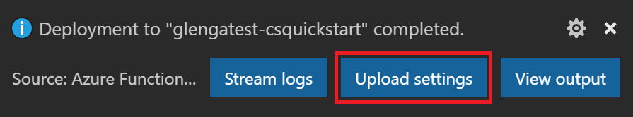

# vidya azureresume
My own cloud resume challenge

## First steps

- Frontend folder contains the website.
- viewCount.js file contains the visitor counter code.

## Created backend 
- Azure Cosmos DB on Azure with Container to store count value.
- Setup Azure Function app locally on VS code
- Install Azure Functions Core Tools (VS code)
- Run below command 
```bash
npm i -g azure-functions-core-tools@4 --unsafe-perm true
```

- To start azure functions locally

```bash
func host start
```

- To bind Cosmos DB Azure Functions app python
  - add to requirements.txt 
  - run pip install to install requirements
```bash
pip install -r requirements.txt
``` 
  - Update local.settings.json file with Cosmos DB credentials (kept secret)
- Update Git adding .gitignore file add local.settings.json 

##Deploy Azure Function App

- Deploy locally created Function App to Azure
  - Choose Create Azure Function app on Azure advanced option on VS Code
  - Choose/Create Resource Group, Storage Account, App Insights
  - Update Python Runtime Version in Azure Portal -> Function App -> Settings -> Configuration -> Stack Settings
  - Upload the settings locally so that function is deployed properly to Azure (when you deploy from VS code click the option upload settings) - local.settings.json file contains cosmos-connection-string



## Deployed the Front end website (again) with the updated javascript 

- Update the CORS on Azure Functions app with primary endpoint(azure storage static website) so that the visitor count is visible.

## Azure CDN/FrontDoor deployment failed

- Free Trial and Student account is forbidden for Azure Frontdoor resources.

## CI/CD - Github workflows
- Create .github folder and create workflows for frontend and backend yml files.
- Generate the deployment credentials by running the following command.
  ```bash
  az ad sp create-for-rbac --name {myStaticSite} --role contributor --scopes /subscriptions/{subscription-id}/resourceGroups/{resource-group} --sdk-auth
  ```
- JSON output will have the credentials and paste them to Github->Settings->Security (Secrets and variables)->New secret

## Python unittest
- Create the `test_app.py` file in the same directory as `function_app.py` file.
- Run below command to install pytest and azure-functions
```bash
pip install pytest azure-functions
``` 
- **Problem Statement **- the environment variables defining the COSMOS DB details outside of a decorated Azure Function @app.function. the code that handles container_details and initializes the blob client is likely running at the global level during startup. 
- To resolve this, you need to ensure that the setup logic runs only when the function is invoked, or that any global initialization is robust and wrapped in error handling. 
- Updated the function_app.py by creating a global function to wrap COSMOS DB details and runs only when the function is invoked. This helped to create a mock container during unittest

- Unittest tests with mock cosmos container for initial function app setup and subsequent update
- Command to run tests
  
```bash
pytest test_app.py
``` 
## Github workflow - frontend and backend yml file

- frontend.main.yml - Use templates from Azure to upload/deploy blob storage when changes are made to frontend/HTML code.
- (https://learn.microsoft.com/en-us/azure/storage/blobs/storage-blobs-static-site-github-actions?tabs=openid)
- backend.main.yml - Used to deploy Azure function app and Run tests when changes are made to backend/tests/function app code.
- (https://learn.microsoft.com/en-us/azure/azure-functions/functions-how-to-github-actions?tabs=linux%2Cpython&pivots=method-template)

## Terraform your Cloud Resume Challenge

- Create frontend resources for static website using Azure storage account.
- To upload all the files from frontend `for_each` was used in the terraform `azurerm_storage_blob` but this is not recommended as Terraform does not manage deletions. If you remove a file from your local frontend folder and run `terraform apply`, Terraform will not automatically delete the corresponding blob in the Azure Storage account. The old, stale file will remain hosted.
- Terraform doesnot create/is not recommended to create item documents within azure cosmos db. So function_app.py is updated to create items if it doesnot exists.
- The function api must be zipped and uploaded to the Azure Function app. For testing manually, these commands were used -
- 
```bash
cd api
zip -r functionapp.zip .
``` 

```bash
az functionapp deployment source config-zip \
  --resource-group rg-func-api \
  --name my-func-api \
  --src functionapp.zip
 ``` 

- The above method doesn't load the function app so function app was published using below command -

 ```bash
  func azure functionapp publish <function_app_name>
```

- When manually updated the function app api URL to `viewCount.js` file on static website on Azure Storage account, the faced caching issue that the primary endpoint was still relying on the old API. If CDN was enable we need to purge otherwise do a hard refresh (`Cmd+Shift+R`) on MAC that worked!

## Github workflow with Terraform infra

- Create backend(Azure resource group & Storage account) on Azure for terraform to store tfstate files and export `access_key`
- To configure the backend state, you need the following Azure storage information:

  - storage_account_name: The name of the Azure Storage account.
  * container_name: The name of the blob container.
  + key: The name of the state store file to be created.
  - access_key: The storage access key.
  
```bash
ACCOUNT_KEY=$(az storage account keys list --resource-group $RESOURCE_GROUP_NAME --account-name $STORAGE_ACCOUNT_NAME --query '[0].value' -o tsv)
export ARM_ACCESS_KEY=$ACCOUNT_KEY
```

- Inorder to update the newly created Function app API URL to `viewCount.js` file, it is being coded to fetch from `appconfig.js` file. `appconfig.js` file is generated during CI/CD. creates the file at build/deploy time, not in your repo. You won’t see it in GitHub. You will see it in the deployed site.

- Since `.gitignore` file was not placed at the right position, terraform config/binaries files were not ignored from staged and ultimately was tried to push to git. To remove manually from staging -
```bash
git rm -r --cached infra/.terraform
```
And to go one level up commit 
`git reset --soft HEAD~1` undoes the last commit but keeps all your changes staged. (Used when unwanted files commited/Wrong commitmessgaed updated)

- Updated the test_app.py file according to functio_app.py changes thanks to Google Gemini.
- 